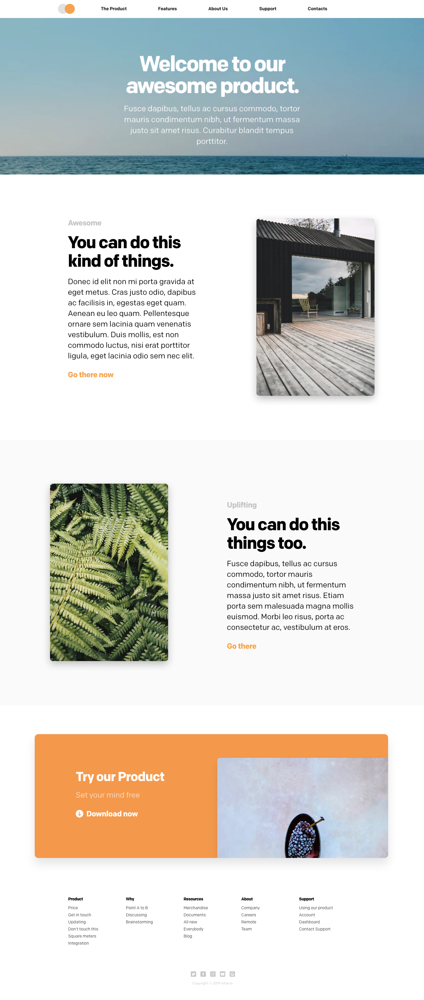
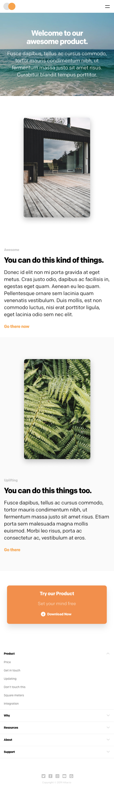

# Altar: gig-design

## STEPS

1. Use these images and design them in [Figma](https://www.figma.com) (free software)
2. You'll be evaluated for:
   1. Layer **organization**
   2. Layer **naming**
   3. Use of **Nested Components**
   4. Use of **Color Variables**
3. The goal is to reproduce the images below, one for desktop and other for phone
4. All images are provided in the `images/` folder in this repository
5. When it's done share the Figma link with us via email

---

## IMAGES

### Desktop

---

### Phone

